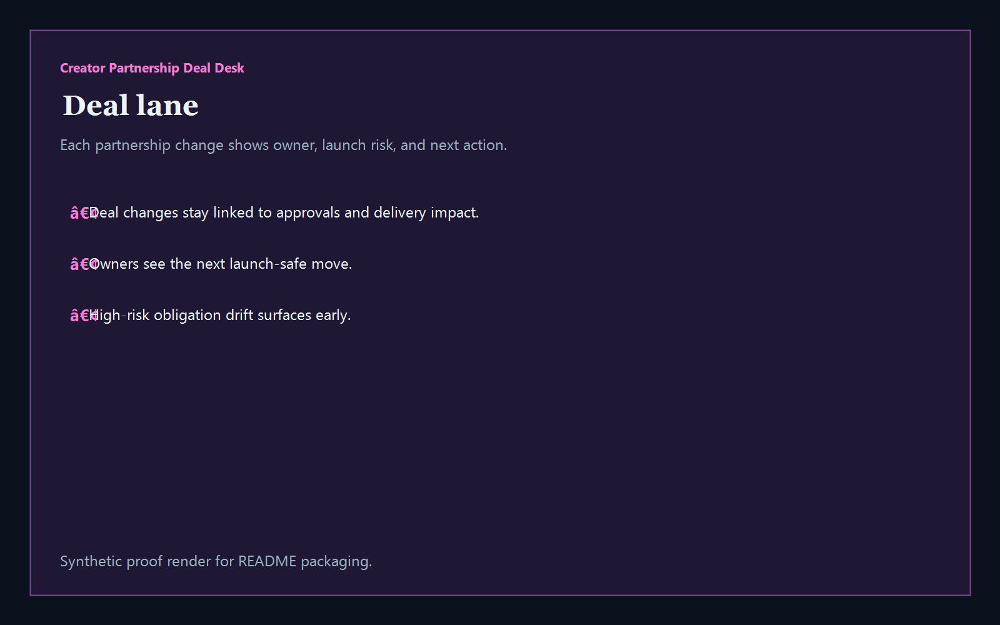
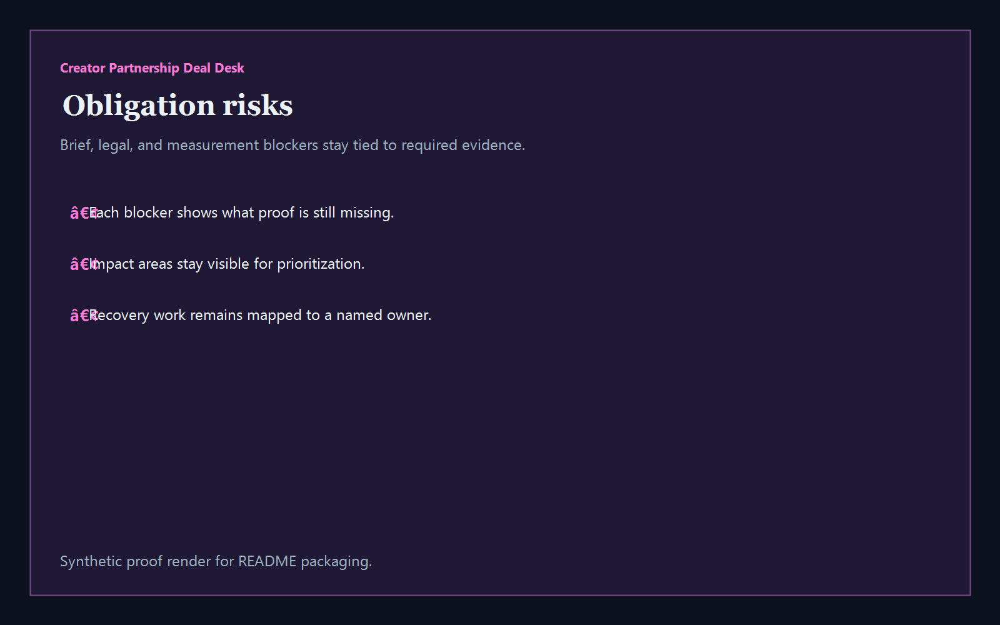
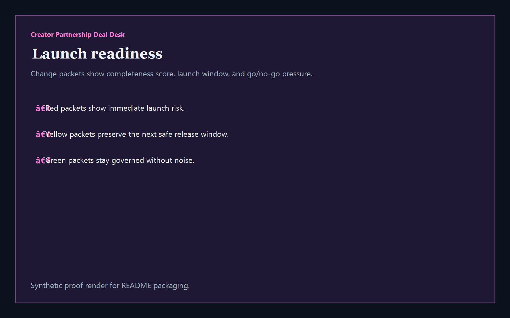

# Creator Partnership Deal Desk

[](https://github.com/mizcausevic-dev/creator-partnership-deal-desk/actions/workflows/ci.yml)
[](./LICENSE)
[](./.github/dependabot.yml)
[](https://github.com/mizcausevic-dev/creator-partnership-deal-desk/actions/workflows/pages.yml)


TypeScript deal desk for creator partnerships, deliverable governance, offer review, launch-safe approvals, and buyer-facing collaboration operations.

## Why this exists

- Social and creator teams lose leverage when partner terms, deliverables, and launch approvals live in separate tools.
- Creator partnerships need a clear view of which deliverables, approvals, and schedule dependencies still block the next campaign or launch.
- Social / Creator Economy leaders care whether a partnership can ship safely without fragmenting briefs, measurements, or commercial commitments.
- Growth buyers want operator tooling that turns partnership chaos into governed launches, ownership, and measurable delivery readiness.

## Why this matters (KG Embedded tie-back)

This repo demonstrates the creator-partnership governance primitive for Social / Creator Economy buyers: deal changes, obligation blockers, and launch posture tied into one operator surface. A B2B SaaS buyer would care because creator, campaign, and reporting data often need to surface inside customer-facing products without exposing unsafe write paths or fragmented launch evidence. Kinetic Gain Embedded extends this into security-first in-product analytics for creator, partnership, and growth workflows, see [kineticgain.com/embedded](https://kineticgain.com/embedded).

## Routes

- `/`
- `/deal-lane`
- `/obligation-risks`
- `/launch-readiness`
- `/verification`
- `/docs`

## API

- `/api/dashboard/summary`
- `/api/deal-lane`
- `/api/obligation-risks`
- `/api/launch-readiness`
- `/api/verification`
- `/api/sample`

## Screenshots






## Local Development

```powershell
cd creator-partnership-deal-desk
npm install
npm run dev
```

Open:
- [http://127.0.0.1:5530/](http://127.0.0.1:5530/)
- [http://127.0.0.1:5530/deal-lane](http://127.0.0.1:5530/deal-lane)
- [http://127.0.0.1:5530/obligation-risks](http://127.0.0.1:5530/obligation-risks)
- [http://127.0.0.1:5530/launch-readiness](http://127.0.0.1:5530/launch-readiness)
- [http://127.0.0.1:5530/verification](http://127.0.0.1:5530/verification)

## Validation

- `npm run build`
- `npm run test`
- `npm run coverage`
- `npm run demo`
- `npm run smoke`
- `npm run prerender`
- `npm run render:assets`

## Production status

<!-- Maintained by Claude Code (Platform/SRE lane) after v1.0-prod hardening. -->

| Aspect | Status |
|--------|--------|
| CI | Node 20 + 22 matrix — lint · typecheck · coverage · build · demo · smoke · `npm audit` ([workflow](./.github/workflows/ci.yml)) |
| Test coverage | 100% statements on `src/services/` (gate: ≥ 60%) |
| License | [AGPL-3.0-or-later](./LICENSE) |
| Dependencies | Dependabot weekly (npm + GitHub Actions); `npm audit --audit-level=high` in CI |
| Security | [SECURITY.md](./SECURITY.md) — 0 known high/critical advisories at v1.0-prod |
| Deploy | Static prerender → **https://creators.kineticgain.com/** (GitHub Pages, [pages workflow](./.github/workflows/pages.yml)) |

## Docs

- [Architecture](./docs/architecture.md)
- [Origin](./docs/ORIGIN.md)
- [Kinetic Gain Embedded tie-back](./docs/KINETIC_GAIN_EMBEDDED.md)
- [Changelog](./CHANGELOG.md)

## Part of the Kinetic Gain Suite

Operator surface in the [Kinetic Gain Suite](https://suite.kineticgain.com/) — a portfolio of buyer-readable control planes spanning security posture, compliance evidence, data-platform governance, FinOps, and operator workflows. See the suite index for related surfaces. Apex: [kineticgain.com](https://kineticgain.com/).
